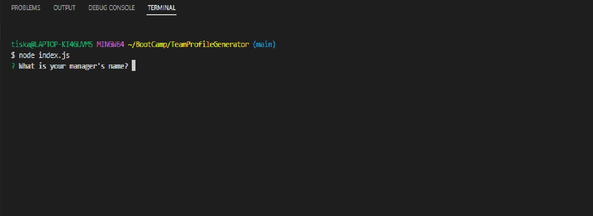
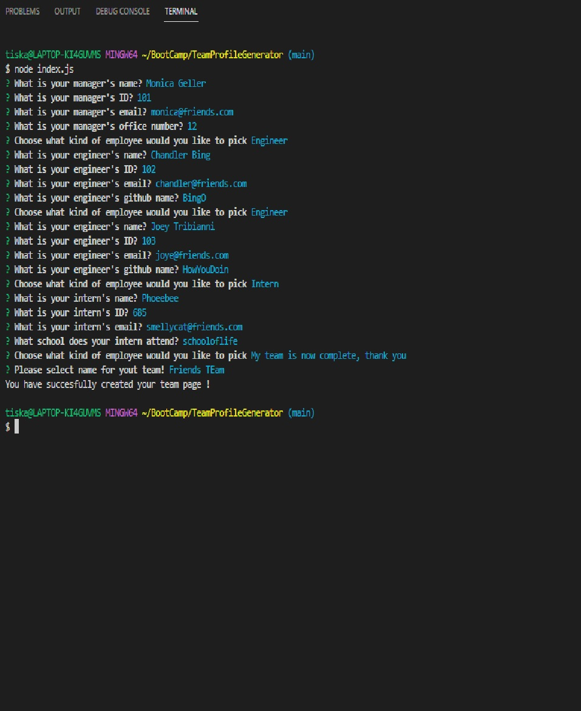
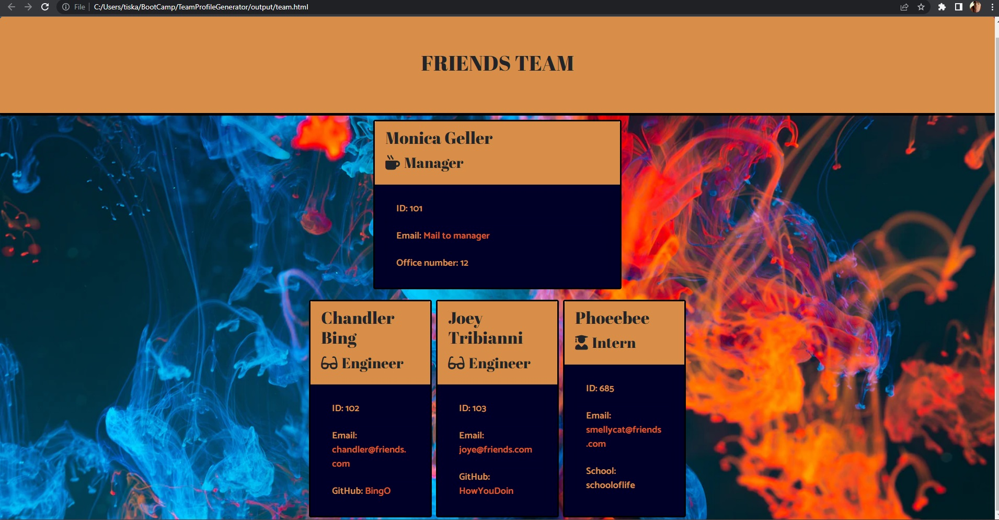

# TeamProfileGenerator
CLI application that generates HTML page. 
# Team HTML page generator 
## Description
This is Command Line Interface application that creates html page containing information about the team memebrs after entered into terminal. This project was created in node using the npm. Styling was done through bootstrap as well as custom stylesheet.
[HERE](https://github.com/FrantiskaAli) is link to my HTML.

## Table of content
- [Installation](#Installation)
- [Usage](#Usage)
- [License](#License)
- [Contributions](#Contributions)
- [Tests](#Tests)
- [Questions](#Questions)
## Images of my application
#### Starting the application

#### This is how the prompts look like

#### Screenshot of final styled HTML

## Installation
npm install
## Usage
- Open command line
- Answer series of qustions about your team (starting with manager and then options to pick whichever post you would like)
- view in team.html
## License
GNU General Public License v3.0 is used on this project.
## Contributing
FranAli, we did have our instructor help us pseudocode at the beggining of the officehours
## Tests
jest tests for Employee.js, Engineer.js, Intern.js, Manager.js
## Questions
If you have any more questions for the project you can always contact me on my [email](mailto:tiskarechk@gmail.com).  
[HERE](https://github.com/FrantiskaAli) is link to my github account. 
